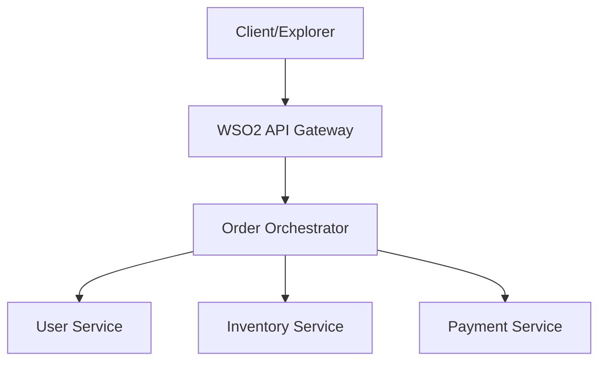

# Choreo Microservices Orchestration System

A production-grade microservices architecture demonstrating centralized orchestration, automated DevOps workflows, and seamless deployment on WSO2 Choreo.

## 🏗️ Architecture Overview

The system consists of an Order Orchestrator that coordinates requests across specialized microservices.



## 🚀 Services Description

| Service | Responsibility | Port | Key Endpoints |
|---------|----------------|------|---------------|
| **User Service** | User profile management | 8080 | `GET /user` |
| **Inventory Service** | Real-time stock tracking | 8081 | `GET /inventory/:item` |
| **Payment Service** | Transaction processing | 8082 | `POST /pay` |
| **Order Orchestrator** | Service Coordination | 8080 | `POST /order` |

## 🛠️ Tech Stack
- **Runtime**: Node.js 20.x
- **Framework**: Express.js
- **HTTP Client**: Axios (with centralized error handling)
- **Deployment**: WSO2 Choreo Internal Developer Platform

## 📦 Local Setup

1. **Clone the repository**
2. **Install dependencies in each service folder**:
   ```bash
   cd services/user-service && npm install
   cd ../inventory-service && npm install
   cd ../payment-service && npm install
   cd ../../orchestrator/order-orchestrator && npm install
   ```
3. **Run services**:
   Each service respects the `PORT` environment variable.

## ☁️ Live Choreo Endpoints (Development)

The system is deployed and active on WSO2 Choreo. You can test the orchestration logic using the following live endpoints:

*   **Order Orchestrator (Gateway)**: [https://ee109b02-dea5-436d-a8b8-e17df34b50b3-dev.e1-us-east-azure.choreoapis.dev/user-service-project/order-orchestrator/v1.0](https://ee109b02-dea5-436d-a8b8-e17df34b50b3-dev.e1-us-east-azure.choreoapis.dev/user-service-project/order-orchestrator/v1.0)
*   **User Service**: `https://ee109b02-dea5-436d-a8b8-e17df34b50b3-dev.e1-us-east-azure.choreoapis.dev/user-service-project/user-service/v1.0`
*   **Inventory Service**: `https://ee109b02-dea5-436d-a8b8-e17df34b50b3-dev.e1-us-east-azure.choreoapis.dev/user-service-project/inventory-service/v1.0`
*   **Payment Service**: `https://ee109b02-dea5-436d-a8b8-e17df34b50b3-dev.e1-us-east-azure.choreoapis.dev/user-service-project/payment-service/v1.0`

## 🧪 Testing the Orchestration
Use a tool like `curl` or Postman to hit the Orchestrator's `/order` endpoint:
```bash
curl -X POST https://ee109b02-dea5-436d-a8b8-e17df34b50b3-dev.e1-us-east-azure.choreoapis.dev/user-service-project/order-orchestrator/v1.0/order \
     -H "Content-Type: application/json" \
     -d '{"userId": "1", "item": "laptop", "amount": 1200}'
```

---
*Created with ❤️ by Antigravity AI for Perera1325*
