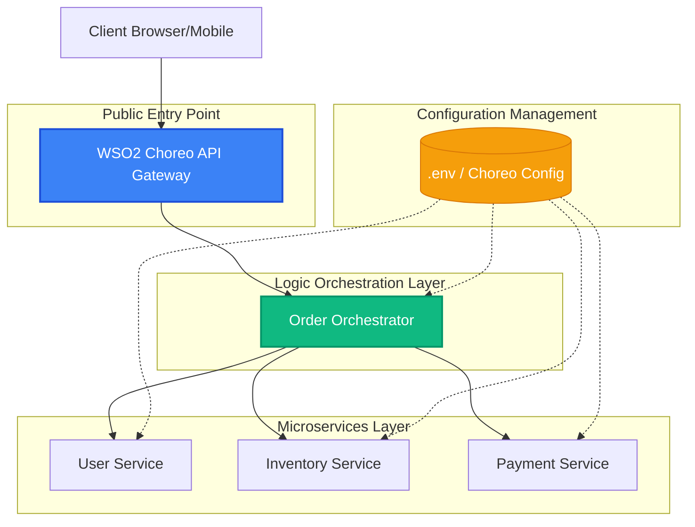
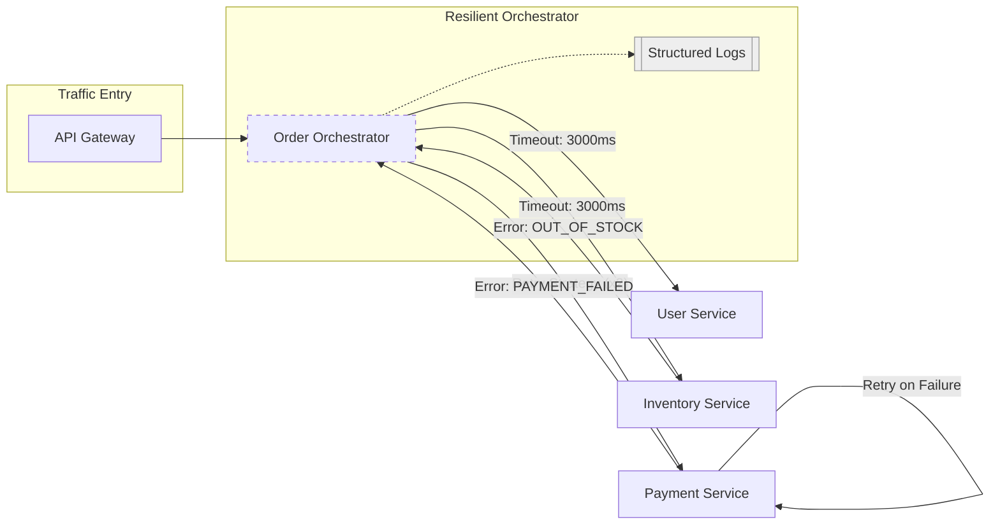
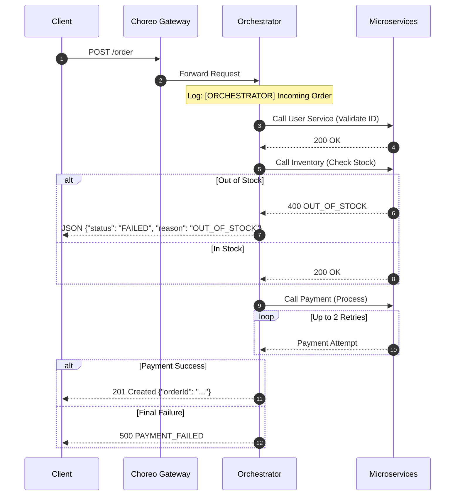

# 🚀 Choreo Microservices Orchestration System

A production-quality microservices system demonstrating **Distributed Orchestration**, **Resilience Patterns**, and **Enterprise Observability** on WSO2 Choreo.

## 🏗️ Enterprise Architecture

Our system is designed with a robust directed-flow topology, utilizing an API Gateway for security and centralized orchestration for complex business logic. These diagrams were validated using the **Choreo Dependency Graph** within the production project.

### High-Level Structural Design


### Advanced Layer (Resilience & Observability)
This view highlights the enterprise patterns implemented: **Timeouts**, **Retry Logic**, and **Distributed Logging**.



### System Sequence Flow (POST /order)
The following sequence flow details the exact lifecycle of a request, including the success and failure branches:



## 🚀 API Demonstration Flow

### 1. Success Case (`POST /order`)
**Request Body:**
```json
{
  "userId": "1",
  "item": "laptop",
  "amount": 1200
}
```
**Response:** `200 OK`
```json
{
  "orderStatus": "CONFIRMED",
  "user": { "id": 1, "name": "Vinod" },
  "inventory": { "item": "laptop", "stock": 15 },
  "payment": { "status": "success", "transactionId": "TXN..." }
}
```

### 2. Out of Stock Case
**Response:** `400 Bad Request`
```json
{
  "orderStatus": "FAILED",
  "reason": "OUT_OF_STOCK",
  "item": "mouse"
}
```

### 3. Payment Failure Case
**Response:** `402 Payment Required`
```json
{
  "orderStatus": "FAILED",
  "reason": "PAYMENT_FAILED",
  "details": "timeout of 3000ms exceeded"
}
```

## 🛠️ Infrastructure & Setup

### Environment Variables
| Variable | Description | Default |
|----------|-------------|---------|
| `PORT` | Local service port | 8080 |
| `USER_SERVICE_URL` | Endpoint for user-service | `http://localhost:8080` |
| `INVENTORY_SERVICE_URL` | Endpoint for inventory-service | `http://localhost:8081` |
| `PAYMENT_SERVICE_URL` | Endpoint for payment-service | `http://localhost:8082` |

### Choreo Deployment
This project is optimized for WSO2 Choreo. Each directory (`services/`, `orchestrator/`) maps to an independent **Service Component** using the **NodeJS** build preset.

---
*Developed by Perera1325 as a Cloud DevOps Showcase.*
