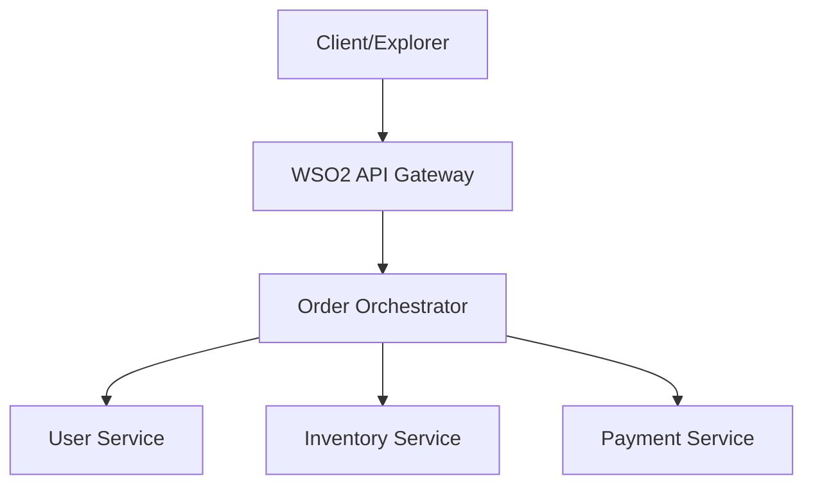

# Choreo Microservices Orchestration System

A production-grade microservices architecture demonstrating centralized orchestration, automated DevOps workflows, and seamless deployment on WSO2 Choreo.

## 🏗️ Architecture Overview

The system consists of an Order Orchestrator that coordinates requests across specialized microservices.



## 🚀 Services Description

| Service | Responsibility | Port | Key Endpoints |
|---------|----------------|------|---------------|
| **User Service** | User profile management | 8080 | `GET /user` |
| **Inventory Service** | Real-time stock tracking | 8081 | `GET /inventory/:item` |
| **Payment Service** | Transaction processing | 8082 | `POST /pay` |
| **Order Orchestrator** | Service Coordination | 8080 | `POST /order` |

## 🛠️ Tech Stack
- **Runtime**: Node.js 20.x
- **Framework**: Express.js
- **HTTP Client**: Axios (with centralized error handling)
- **Deployment**: WSO2 Choreo Internal Developer Platform

## 📦 Local Setup

1. **Clone the repository**
2. **Install dependencies in each service folder**:
   ```bash
   cd services/user-service && npm install
   cd ../inventory-service && npm install
   cd ../payment-service && npm install
   cd ../../orchestrator/order-orchestrator && npm install
   ```
3. **Run services**:
   Each service respects the `PORT` environment variable.

## ☁️ Choreo Deployment Guide

1. **Connect Repository**: Link your GitHub repo to Choreo.
2. **Create Components**:
   - Create 4 separate "Service" components.
   - Point each to its respective directory (`services/user-service`, etc.).
   - Use the **NodeJS** build preset.
3. **Configure Orchestrator Environment**:
   Set the following environment variables in the Orchestrator's configuration:
   - `USER_SERVICE_URL`
   - `INVENTORY_SERVICE_URL`
   - `PAYMENT_SERVICE_URL`
4. **Deploy**: Trigger "Build & Deploy" for all components.

## 🧪 Testing the Orchestration
Use the following payload for the Orchestrator's `POST /order` endpoint:
```json
{
  "userId": "123",
  "item": "laptop",
  "amount": 1200
}
```

---
*Created with ❤️ by Antigravity AI for Perera1325*
