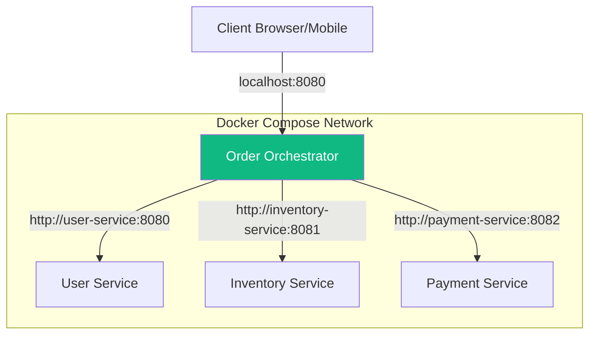

# 🚀 Choreo Microservices Orchestration (Standalone Version)

A production-quality microservices system demonstrating **Distributed Orchestration**, **Resilience Patterns**, and **Container Orchestration** using Docker.

## 🏗️ Enterprise Architecture (Local)

The system is now fully standalone and can be run locally using **Docker Compose**. It simulates a high-scale e-commerce order flow where a central orchestrator manages multiple specialized microservices within a private virtual network.



### ⚡ Key Resilience Patterns
- **Internal Service Discovery**: Services communicate via Docker-native DNS names.
- **Health Monitoring**: Docker healthchecks monitor the `/health` endpoint of every backend service; the Orchestrator only starts when all dependencies are ready.
- **Timeouts & Retries**: Standard enterprise resilience patterns applied for inter-service communication.

## ☁️ Cloud vs Local Deployment

| Feature | WSO2 Choreo (Current) | Docker Compose (Standalone) |
|---------|-----------------------|-----------------------------|
| **Deployment** | Managed (Cloud) | Manual (Local/Any VM) |
| **Networking** | Choreo Gateways | Private Docker Network |
| **Scalability** | Automated | Configurable via Compose |
| **Cost** | Free Tier Limits | Zero Cost (Open Source) |

## 🚀 Getting Started

### Prerequisites
- Docker & Docker Compose installed on your machine.

### One-Command Run
You can spin up the entire production-style system with a single command:
```bash
docker-compose up --build
```
This will:
1. Build images for all 4 microservices using `Dockerfile`s.
2. Initialize the private microservices network.
3. Start healthchecks for backend services.
4. Expose the Order Orchestrator on `localhost:8080`.

## 🚀 API Demonstration

### POST /order (Success Case)
**Endpoint**: `http://localhost:8080/order`

**Payload**:
```json
{
  "userId": "1",
  "item": "laptop",
  "amount": 1200
}
```

## 📊 Health Monitoring
Each service provides a health status at `/health`:
- `GET http://localhost:8081/health` (Mapping to user-service)
- `GET http://localhost:8082/health` (Mapping to inventory-service)

---
*Transformed from Choreo-native to Open Source Standalone by Perera1325.*
