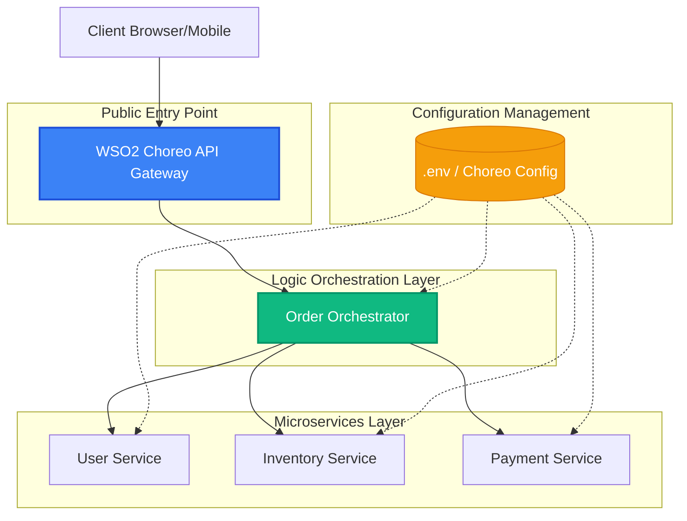
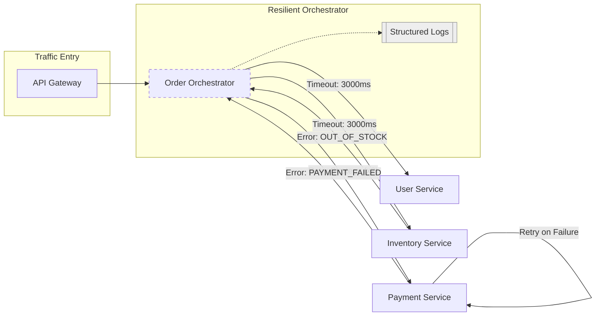
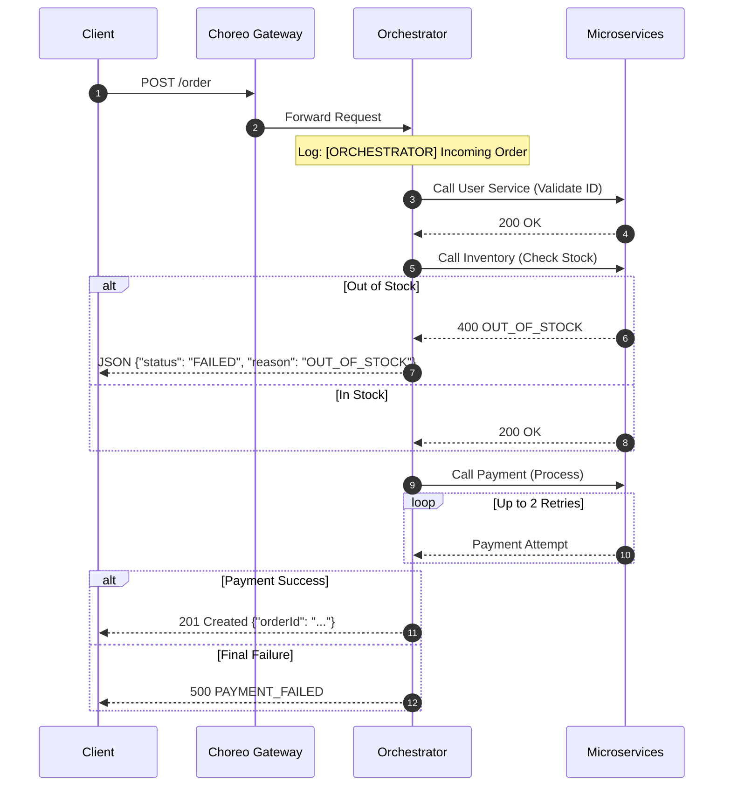

# Choreo Microservices Orchestration (Standalone Version)

This repository contains a production-grade microservices system demonstrating distributed orchestration, resilience patterns, and container orchestration using Docker.

## Engineering Architecture and System Stability

The implementation follows industry-standard engineering practices for distributed systems to ensure reliability and maintainability.

### Resilience and Failover Patterns
- **Timeouts and Retries**: Each service-to-service communication is governed by a 3000ms timeout and an exponential retry mechanism for critical business paths, specifically the payment processing flow.
- **Graceful Shutdown**: Every microservice implements native signal handling for SIGTERM and SIGINT. This ensures that in production environments such as Kubernetes or WSO2 Choreo, the service completes pending requests and terminates network connections cleanly before the process exits.

### Continuous Integration and Deployment Quality
- **GitHub Actions CI**: An automated pipeline validates the integrity of every commit through syntax verification and high-level security audits using npm audit.
- **Vulnerability Scanning**: The system is integrated with Trivy for container-level security scanning within the build pipeline.

---

## System Architecture

The system utilizes a directed-flow topology with a centralized API Gateway and an orchestration layer for complex business logic. These diagrams represent the live environment as deployed on WSO2 Choreo.

### Enterprise Resource Catalog (Native Graph)

*Figure 1: Official Choreo Architecture Diagram showing project boundaries and service dependencies.*

### Structural Design

*Figure 2: Project overview and resource dependency graph within the Choreo environment.*



### Component Lifecycle and Management

*Figure 2: Status of managed microservice components in the production console.*

### Infrastructure Resilience and Networking
This view illustrates the implementation of timeouts, retry logic, and distributed logging patterns.



### API Validation and System Flow

*Figure 3: System validation via the integrated OpenAPI testing interface.*

### Request Lifecycle (POST /order)
The following sequence details the lifecycle of an order request, including conditional branches for inventory and payment status.



## Cloud Environment vs Local Infrastructure

| Infrastructure Aspect | WSO2 Choreo (Cloud) | Docker Compose (Local) |
|-----------------------|---------------------|-------------------------|
| Deployment Model | Fully Managed | Container Orchestration |
| Networking | Virtual API Gateway | Private Virtual Network |
| Scalability | Automated Scaling | Vertical Static Limits |
| Cost Model | Usage Based | Infrastructure Neutral |

## Deployment and Local Installation

### Prerequisites
- Docker and Docker Compose must be installed on the host machine.

### Execution Command
The entire system can be initialized with a single command:
```bash
docker-compose up --build
```
This command performs the following operations:
1. Builds local images for all microservices using the provided Dockerfiles.
2. Establishes a private virtual network for container communication.
3. Initiates health monitoring for dependent services.
4. Exposes the Order Orchestrator on host port 8080.

## Observability and Automated CI/CD

The system leverages the WSO2 Choreo DevOps suite to maintain high deployment quality and security.

### Automated Pipeline and Security Scanning

*Figure 4: Automated CI/CD pipeline including environment initialization, container build, and Trivy security auditing.*

Every commit to the main branch triggers the following lifecycle:
1.  **Environment Provisioning**: Deployment of dynamic build resources.
2.  **Container Compilation**: Building and optimizing Node.js images.
3.  **Security Auditing**: Comprehensive scanning for vulnerabilities via Trivy.
4.  **Registry Distribution**: Pushing versioned images to a private secure registry.

## API Interface and Specification

### POST /order (Verification Case)
**Endpoint**: `http://localhost:8080/order`

**Request Payload**:
```json
{
  "userId": "1",
  "item": "laptop",
  "amount": 1200
}
```

## System Health Monitoring
All services provide real-time health diagnostics via the `/health` endpoint:
- **User Service**: `GET http://localhost:8081/health`
- **Inventory Service**: `GET http://localhost:8082/health`

---
*Standalone architecture and system transformation by Perera1325.*
