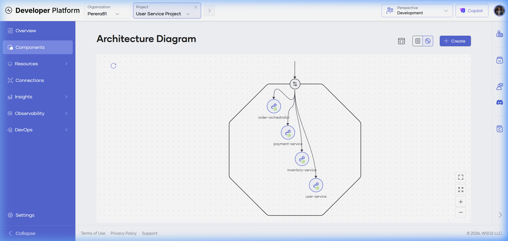
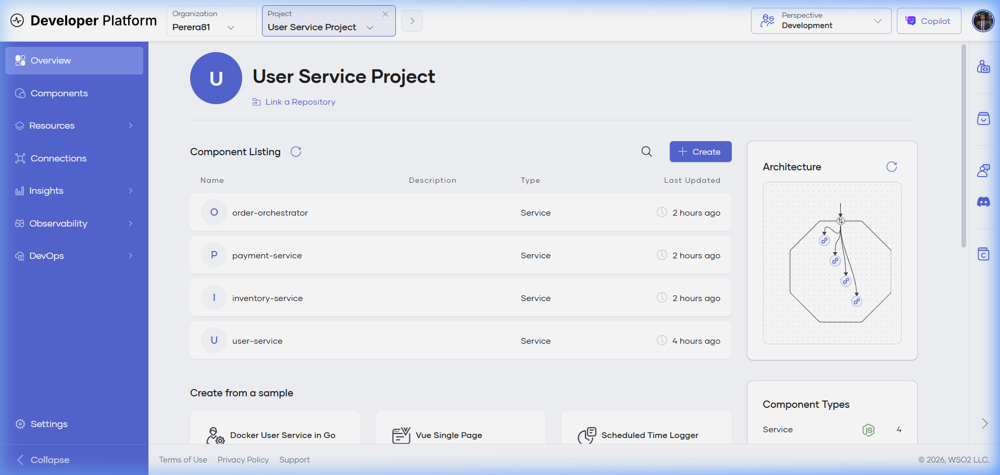
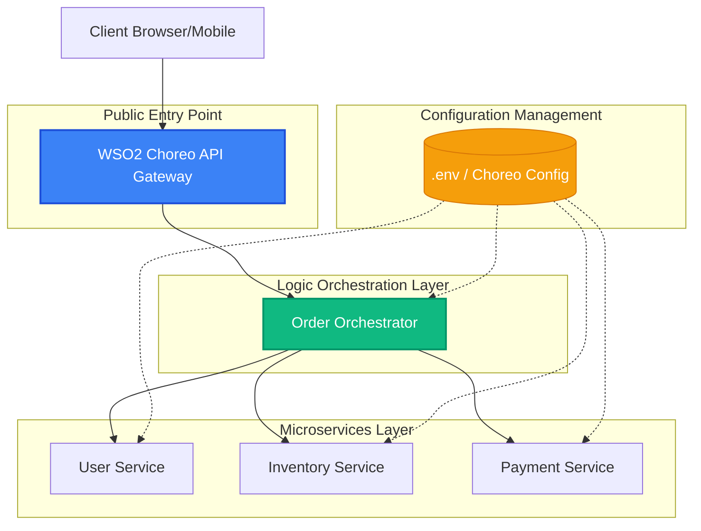
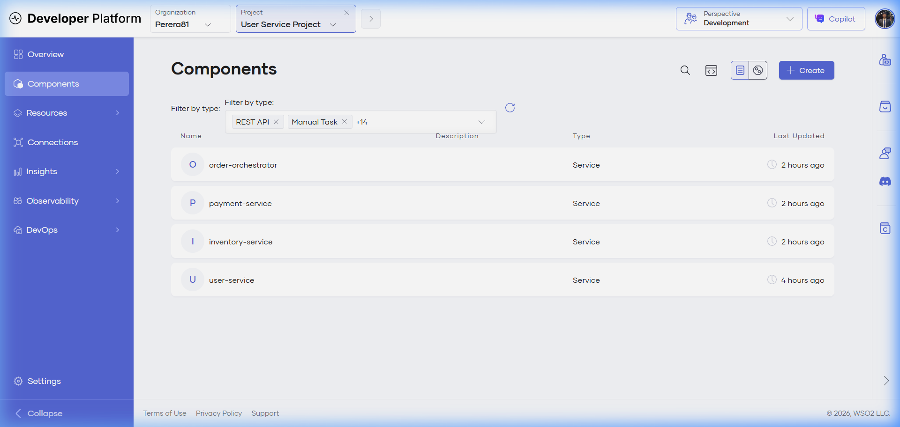
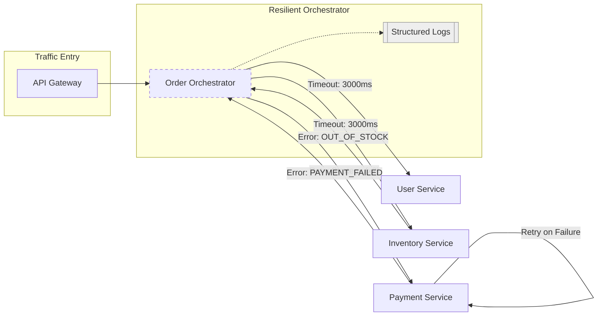
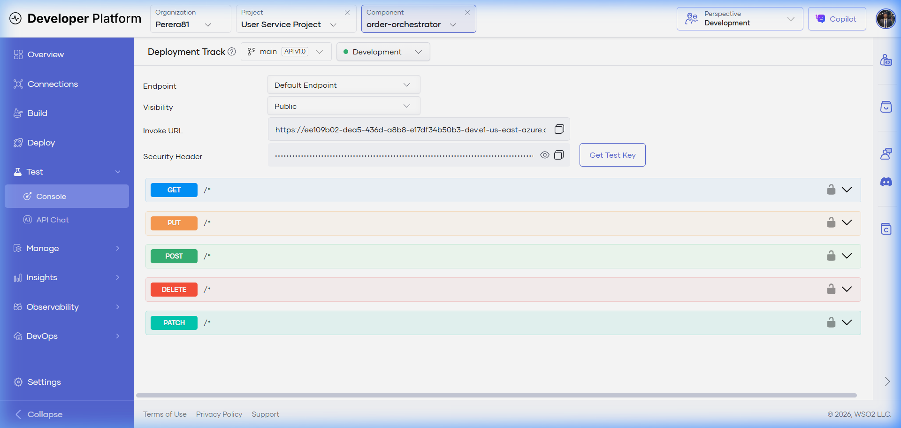
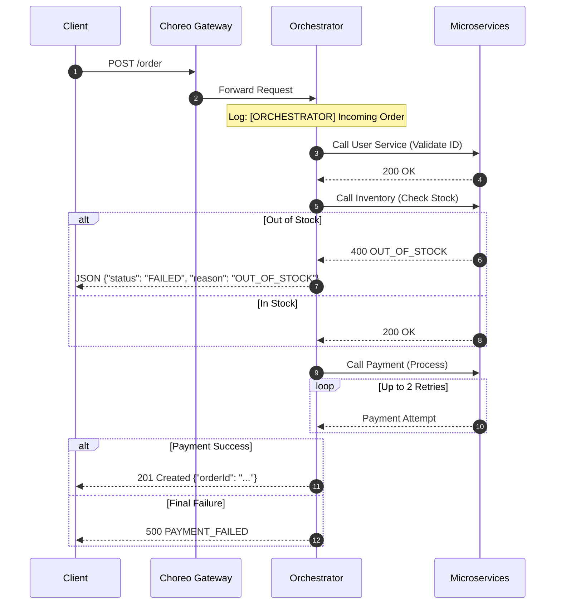
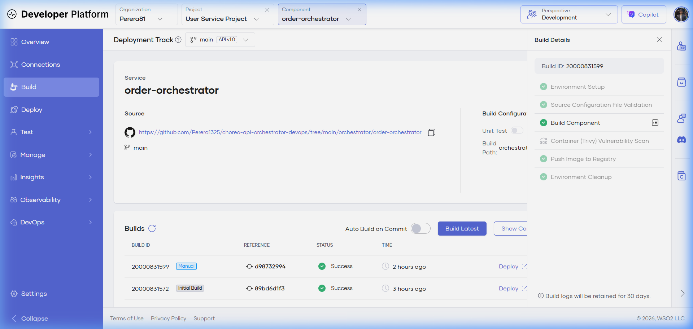

# 🚀 Choreo Microservices Orchestration (Standalone Version)

A production-quality microservices system demonstrating **Distributed Orchestration**, **Resilience Patterns**, and **Container Orchestration** using Docker.

## 🏗️ Enterprise Architecture

Our system is designed with a robust directed-flow topology, utilizing an API Gateway for security and centralized orchestration for complex business logic. These diagrams reflect the live environment deployed on WSO2 Choreo.

### Enterprise Resource Catalog (Native Graph)

*Figure 1: Official Choreo Architecture Diagram showing project boundaries and service dependencies.*

### High-Level Structural Design

*Figure 2: Live Dependency Graph & Project Overview in WSO2 Choreo.*



### 📦 Component Management

*Figure 2: Managed microservices status in the Choreo Console.*

### Advanced Layer (Resilience & Observability)
This view highlights the enterprise patterns implemented: **Timeouts**, **Retry Logic**, and **Distributed Logging**.



### 🧪 API Testing & Flow

*Figure 3: Testing the Order Orchestrator using the integrated OpenAPI console.*

### System Sequence Flow (POST /order)
The following sequence flow details the exact lifecycle of a request, including the success and failure branches:



## ☁️ Cloud vs Local Deployment

| Feature | WSO2 Choreo (Current) | Docker Compose (Standalone) |
|---------|-----------------------|-----------------------------|
| **Deployment** | Managed (Cloud) | Manual (Local/Any VM) |
| **Networking** | Choreo Gateways | Private Docker Network |
| **Scalability** | Automated | Configurable via Compose |
| **Cost** | Free Tier Limits | Zero Cost (Open Source) |

## 🚀 Getting Started

### Prerequisites
- Docker & Docker Compose installed on your machine.

### One-Command Run
You can spin up the entire production-style system with a single command:
```bash
docker-compose up --build
```
This will:
1. Build images for all 4 microservices using `Dockerfile`s.
2. Initialize the private microservices network.
3. Start healthchecks for backend services.
4. Expose the Order Orchestrator on `localhost:8080`.

## 📊 Enterprise Observability & CI/CD

Our system utilizes WSO2 Choreo's advanced DevOps capabilities to ensure every deployment is secure, optimized, and verified.

### 🛡️ Automated CI/CD & Security Scan

*Figure 4: Automated build action including environment setup, containerization, and Trivy vulnerability scanning.*

Every commit to the `main` branch triggers a multi-stage pipeline:
1.  **Environment Setup**: Dynamic provisioning of build resources.
2.  **Build Component**: Native Node.js build and optimization.
3.  **Security Scan**: INTEGRATED **Trivy** vulnerability scanning for all container layers.
4.  **Registry Push**: Versioned images pushed to the internal secure registry.

## 🚀 API Demonstration Flow

### POST /order (Success Case)
**Endpoint**: `http://localhost:8080/order`

**Payload**:
```json
{
  "userId": "1",
  "item": "laptop",
  "amount": 1200
}
```

## 📊 Health Monitoring
Each service provides a health status at `/health`:
- `GET http://localhost:8081/health` (Mapping to user-service)
- `GET http://localhost:8082/health` (Mapping to inventory-service)

---
*Transformed from Choreo-native to Open Source Standalone by Perera1325.*
