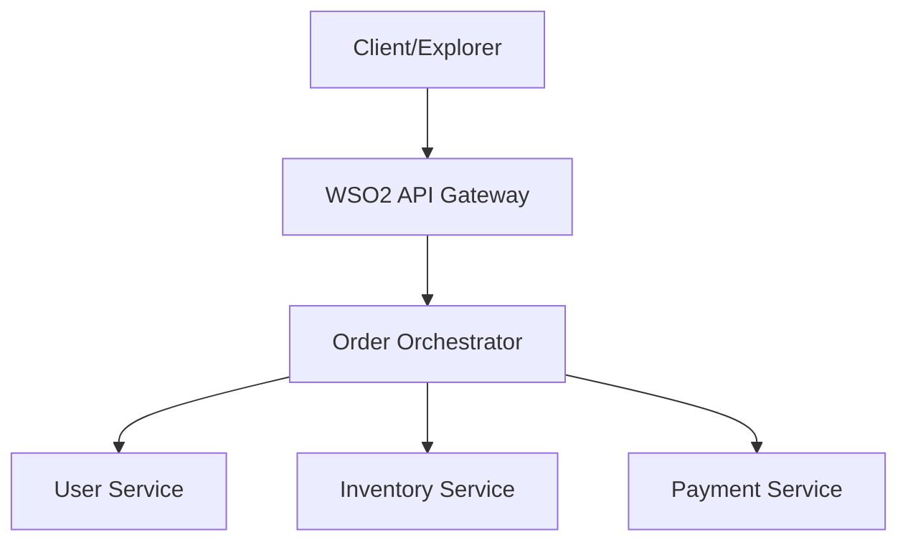

# 🚀 Choreo Microservices Orchestration System

A production-quality microservices system demonstrating **Distributed Orchestration**, **Resilience Patterns**, and **Enterprise Observability** on WSO2 Choreo.

## 🏗️ System Architecture

This project simulates a high-scale e-commerce order flow where a central orchestrator manages multiple specialized microservices.



### ⚡ Key Resilience Patterns
- **Timeouts**: Every service call is protected by a 3000ms Axios timeout to prevent gateway hanging.
- **Retry Mechanism**: The Payment Service call includes a 2-retry logic to handle transient network issues or cold starts.
- **Fail-Fast Error Handling**: Returns precise status codes and reasons (e.g., `OUT_OF_STOCK`, `PAYMENT_FAILED`) instead of generic server errors.

## 📊 Enterprise Observability
Every service implements **Structured Logging**. Logs are prefixed with service names for easy distributed tracing in Choreo's Log Explorer:
- `[ORCHESTRATOR] ---> Calling payment-service...`
- `[PAYMENT-SERVICE] Processing payment of 1200 USD...`
- `[ORCHESTRATOR] <--- Payment service responded successfully.`

## 🚀 API Demonstration Flow

### 1. Success Case (`POST /order`)
**Request Body:**
```json
{
  "userId": "1",
  "item": "laptop",
  "amount": 1200
}
```
**Response:** `200 OK`
```json
{
  "orderStatus": "CONFIRMED",
  "user": { "id": 1, "name": "Vinod" },
  "inventory": { "item": "laptop", "stock": 15 },
  "payment": { "status": "success", "transactionId": "TXN..." }
}
```

### 2. Out of Stock Case
**Response:** `400 Bad Request`
```json
{
  "orderStatus": "FAILED",
  "reason": "OUT_OF_STOCK",
  "item": "mouse"
}
```

### 3. Payment Failure Case
**Response:** `402 Payment Required`
```json
{
  "orderStatus": "FAILED",
  "reason": "PAYMENT_FAILED",
  "details": "timeout of 3000ms exceeded"
}
```

## 🛠️ Infrastructure & Setup

### Environment Variables
| Variable | Description | Default |
|----------|-------------|---------|
| `PORT` | Local service port | 8080 |
| `USER_SERVICE_URL` | Endpoint for user-service | `http://localhost:8080` |
| `INVENTORY_SERVICE_URL` | Endpoint for inventory-service | `http://localhost:8081` |
| `PAYMENT_SERVICE_URL` | Endpoint for payment-service | `http://localhost:8082` |

### Choreo Deployment
This project is optimized for WSO2 Choreo. Each directory (`services/`, `orchestrator/`) maps to an independent **Service Component** using the **NodeJS** build preset.

---
*Developed by Perera1325 as a Cloud DevOps Showcase.*
